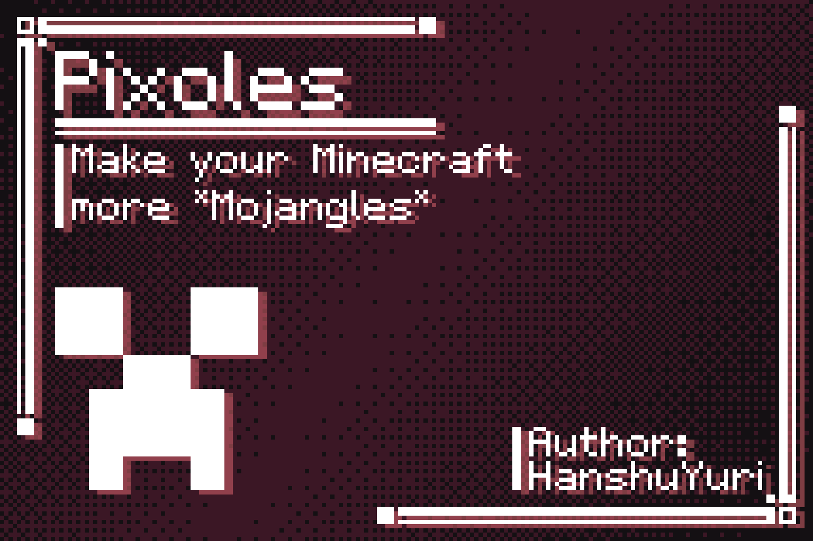
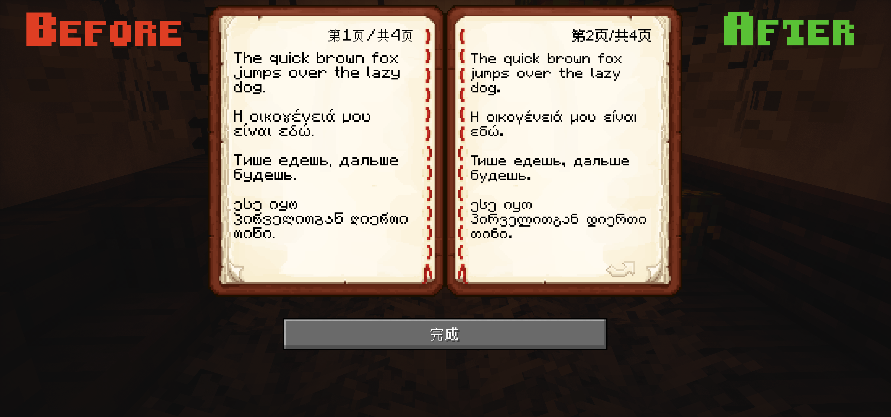
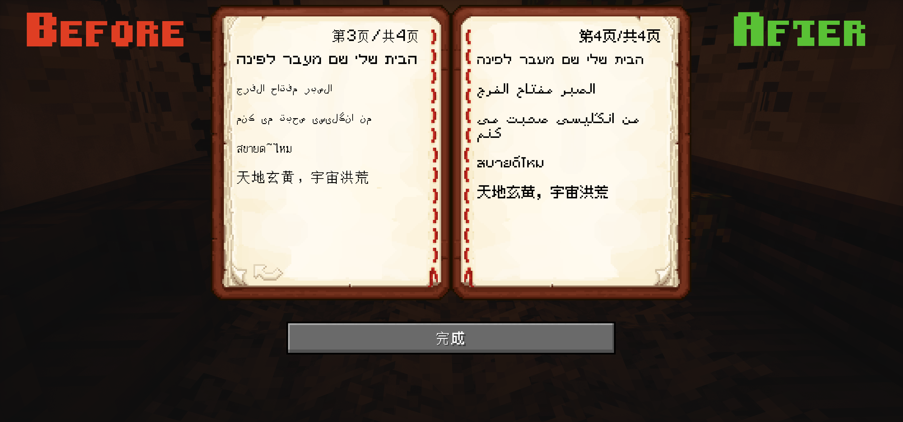

# Pixoles

> *该字体计划应用于Minecraft字体资源包制作中，为Minecraft多语言增添色彩*
> 
> Maybe make your Minecraft more *Mojangles* >:)

> [!WARNING]
> 
> 此字体为实验性项目，其可能存在字形错误等其他问题
> 
> 如有其他问题，请及时通过Issue进行反馈

> [!IMPORTANT]
>
> 本字体采用 《SIL 开放字体许可证第 1.1 版》[LICENSE-OFL](https://openfontlicense.org)，保留字体名称《Pixoles》。
>
> 该字体可免费商用
> 
> 第三方字源许可证如下：
> 
> | 字体 | 许可证 | 备注 |
> |---|---|---|
> | [缝合像素字体 / Fusion Pixel Font](https://github.com/TakWolf/fusion-pixel-font) | [OFL-1.1](https://github.com/TakWolf/fusion-pixel-font/blob/master/README.md) | 提供CJK统一表意汉字相关像素字形
> | [Galmuri](https://github.com/quiple/galmuri) | [OFL-1.1](https://github.com/quiple/galmuri/blob/main/ofl.md) | 提供谚文相关像素字形 |

## 预览 Preview

### 原版调整 Vanilla Tweak

*针对原版mojangles字体已有字形进行适当优化*

此部分支持：
> -拉丁文字
> 
> -希腊文字
> 
> -西里尔文字
> 
> -亚美尼亚文字
> 
> -格鲁吉亚文字
> 
> -希伯来文字

### 多语言适配 Multi-language adaptation

*针对原版mojangles字体中未制作的部分，进行风格统一化*

此部分支持：
> -阿拉伯文字
> 
> -泰文字
> 
> -老挝文字
> 
> -平假名/片假名
> 
> -谚文文字
> 
> -中日韩统一表意文字

## 程序依赖 Program Dependencies
- High-Logic Fontcreator
- [Aseprite](https://github.com/aseprite/aseprite)
